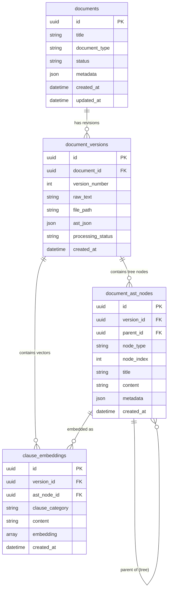

# Possible ORM

```mermaid
erDiagram
    documents ||--o{ document_versions : "has revisions"
    document_versions ||--o{ document_ast_nodes : "contains tree nodes"
    document_versions ||--o{ clause_embeddings : "contains vectors"
    document_ast_nodes ||--o{ document_ast_nodes : "parent of (tree)"
    document_ast_nodes ||--o{ clause_embeddings : "embedded as"

    documents {
        uuid id PK
        string title
        string document_type
        string status
        json metadata
        datetime created_at
        datetime updated_at
    }

    document_versions {
        uuid id PK
        uuid document_id FK
        int version_number
        string raw_text
        string file_path
        json ast_json
        string processing_status
        datetime created_at
    }

    document_ast_nodes {
        uuid id PK
        uuid version_id FK
        uuid parent_id FK
        string node_type
        int node_index
        string title
        string content
        json metadata
        datetime created_at
    }

    clause_embeddings {
        uuid id PK
        uuid version_id FK
        uuid ast_node_id FK
        string clause_category
        string content
        array embedding
        datetime created_at
    }
```